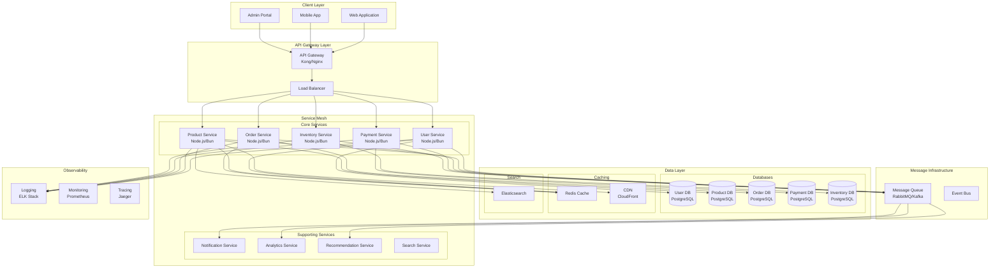
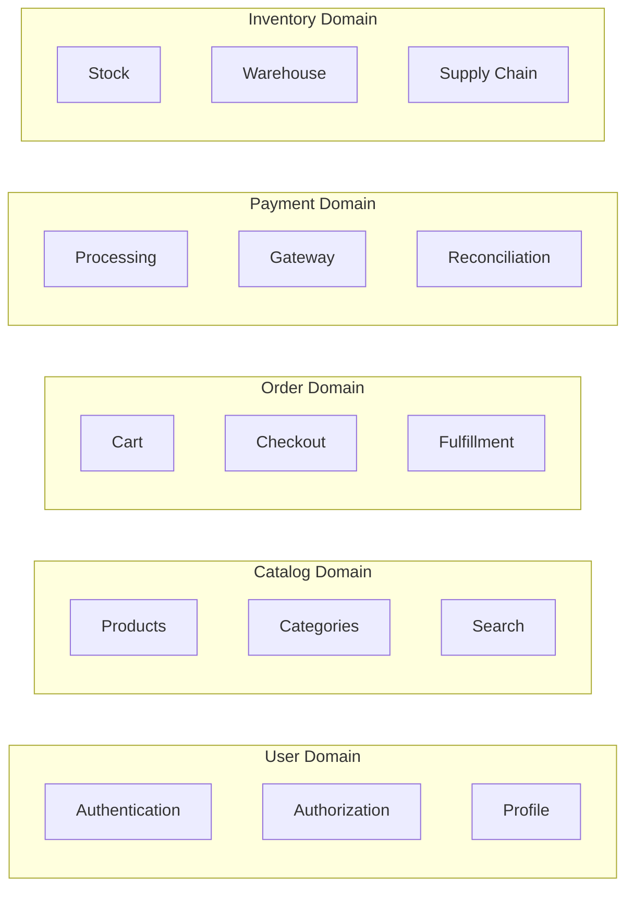
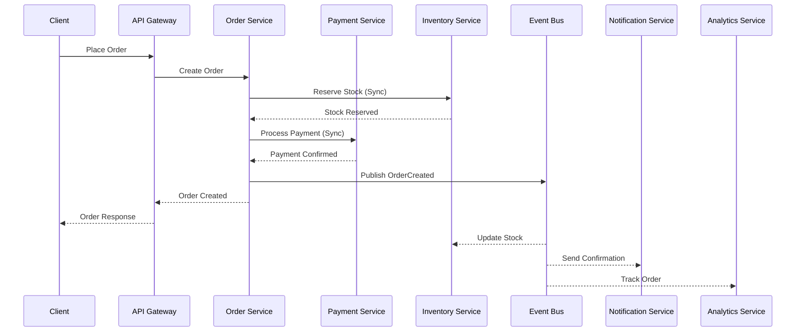
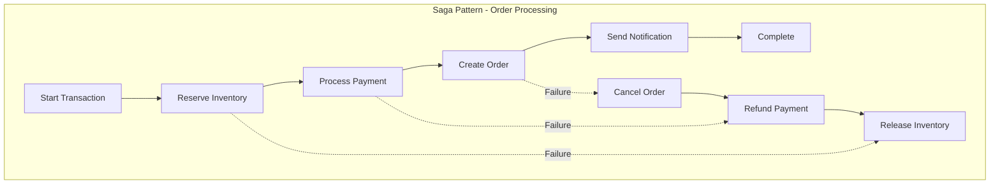
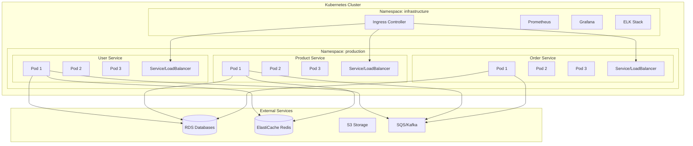

# E-commerce Platform - Microservices Architecture (Task 8.1)

## Executive Summary

This document outlines a comprehensive microservices architecture for a scalable e-commerce platform. The architecture employs domain-driven design principles, event-driven communication patterns, and modern cloud-native technologies to ensure high availability, scalability, and maintainability.

## Architecture Overview



## 1. Microservice Components

### 1.1 User Service

**Responsibilities:**
- User registration and authentication (JWT-based)
- Profile management and preferences
- Role-based access control (RBAC)
- Password reset and account verification
- OAuth 2.0 integration (Google, Facebook, etc.)
- Session management and token refresh

**Technology Stack:**
- Runtime: Bun/Node.js
- Framework: Hono
- Database: PostgreSQL (users, roles, sessions)
- Cache: Redis (session cache, JWT blacklist)
- Authentication: JWT + Refresh Tokens

**API Endpoints:**
```typescript
POST   /api/users/register
POST   /api/users/login
POST   /api/users/refresh
POST   /api/users/logout
GET    /api/users/profile
PUT    /api/users/profile
POST   /api/users/verify-email
POST   /api/users/reset-password
DELETE /api/users/account
```

**Data Model:**
```sql
-- Users table
CREATE TABLE users (
    id UUID PRIMARY KEY,
    email VARCHAR(255) UNIQUE NOT NULL,
    username VARCHAR(100) UNIQUE,
    password_hash TEXT NOT NULL,
    role VARCHAR(50) NOT NULL,
    is_verified BOOLEAN DEFAULT FALSE,
    created_at TIMESTAMP DEFAULT NOW(),
    updated_at TIMESTAMP DEFAULT NOW()
);

-- User profiles
CREATE TABLE user_profiles (
    user_id UUID PRIMARY KEY REFERENCES users(id),
    first_name VARCHAR(100),
    last_name VARCHAR(100),
    phone VARCHAR(20),
    address JSONB,
    preferences JSONB
);
```

### 1.2 Product Service

**Responsibilities:**
- Product catalog management
- Category and brand management
- Product search and filtering
- Product recommendations
- Review and rating management
- Product image management

**Technology Stack:**
- Runtime: Bun/Node.js
- Framework: Hono
- Database: PostgreSQL (products, categories)
- Search: Elasticsearch
- Cache: Redis (product cache)
- CDN: CloudFront (images)

**API Endpoints:**
```typescript
GET    /api/products
GET    /api/products/:id
POST   /api/products
PUT    /api/products/:id
DELETE /api/products/:id
GET    /api/products/search
GET    /api/products/recommendations
POST   /api/products/:id/reviews
GET    /api/categories
```

**Data Model:**
```sql
-- Products table
CREATE TABLE products (
    id UUID PRIMARY KEY,
    sku VARCHAR(100) UNIQUE NOT NULL,
    name VARCHAR(255) NOT NULL,
    description TEXT,
    category_id UUID REFERENCES categories(id),
    price DECIMAL(10,2) NOT NULL,
    images JSONB,
    attributes JSONB,
    status VARCHAR(50) DEFAULT 'active',
    created_at TIMESTAMP DEFAULT NOW(),
    updated_at TIMESTAMP DEFAULT NOW()
);

-- Categories
CREATE TABLE categories (
    id UUID PRIMARY KEY,
    name VARCHAR(100) NOT NULL,
    parent_id UUID REFERENCES categories(id),
    path TEXT, -- Materialized path for hierarchy
    attributes_schema JSONB
);
```

### 1.3 Order Service

**Responsibilities:**
- Order creation and management
- Shopping cart operations
- Order status tracking
- Order history and analytics
- Return and refund management
- Invoice generation

**Technology Stack:**
- Runtime: Bun/Node.js
- Framework: Hono
- Database: PostgreSQL (orders, order_items)
- Cache: Redis (cart cache)
- Queue: RabbitMQ (order processing)

**API Endpoints:**
```typescript
POST   /api/orders
GET    /api/orders
GET    /api/orders/:id
PUT    /api/orders/:id/status
POST   /api/orders/:id/cancel
POST   /api/orders/:id/return
GET    /api/cart
POST   /api/cart/items
DELETE /api/cart/items/:id
POST   /api/cart/checkout
```

**Data Model:**
```sql
-- Orders table
CREATE TABLE orders (
    id UUID PRIMARY KEY,
    user_id UUID NOT NULL,
    order_number VARCHAR(50) UNIQUE NOT NULL,
    status VARCHAR(50) NOT NULL,
    total_amount DECIMAL(10,2) NOT NULL,
    shipping_address JSONB NOT NULL,
    billing_address JSONB NOT NULL,
    payment_id UUID,
    created_at TIMESTAMP DEFAULT NOW(),
    updated_at TIMESTAMP DEFAULT NOW()
);

-- Order items
CREATE TABLE order_items (
    id UUID PRIMARY KEY,
    order_id UUID REFERENCES orders(id),
    product_id UUID NOT NULL,
    quantity INTEGER NOT NULL,
    unit_price DECIMAL(10,2) NOT NULL,
    subtotal DECIMAL(10,2) NOT NULL,
    attributes JSONB
);
```

### 1.4 Payment Service

**Responsibilities:**
- Payment processing (Stripe, PayPal integration)
- Transaction management
- Refund and dispute handling
- Payment method management
- PCI compliance
- Fraud detection

**Technology Stack:**
- Runtime: Bun/Node.js
- Framework: Hono
- Database: PostgreSQL (transactions, encrypted)
- Payment Gateways: Stripe, PayPal
- Security: TLS, encryption at rest

**API Endpoints:**
```typescript
POST   /api/payments/process
POST   /api/payments/refund
GET    /api/payments/:id
GET    /api/payment-methods
POST   /api/payment-methods
DELETE /api/payment-methods/:id
POST   /api/payments/webhook
```

**Data Model:**
```sql
-- Transactions table
CREATE TABLE transactions (
    id UUID PRIMARY KEY,
    order_id UUID NOT NULL,
    user_id UUID NOT NULL,
    amount DECIMAL(10,2) NOT NULL,
    currency VARCHAR(3) NOT NULL,
    status VARCHAR(50) NOT NULL,
    gateway VARCHAR(50) NOT NULL,
    gateway_transaction_id VARCHAR(255),
    metadata JSONB,
    created_at TIMESTAMP DEFAULT NOW()
);

-- Payment methods (tokenized)
CREATE TABLE payment_methods (
    id UUID PRIMARY KEY,
    user_id UUID NOT NULL,
    type VARCHAR(50) NOT NULL,
    token TEXT NOT NULL, -- Encrypted
    last_four VARCHAR(4),
    expires_at DATE,
    is_default BOOLEAN DEFAULT FALSE
);
```

### 1.5 Inventory Service

**Responsibilities:**
- Real-time inventory tracking
- Stock level management
- Warehouse operations
- Supply chain integration
- Stock reservation during checkout
- Low stock alerts

**Technology Stack:**
- Runtime: Bun/Node.js
- Framework: Hono
- Database: PostgreSQL (inventory, warehouses)
- Cache: Redis (stock levels)
- Queue: RabbitMQ (stock updates)

**API Endpoints:**
```typescript
GET    /api/inventory/:product_id
PUT    /api/inventory/:product_id
POST   /api/inventory/reserve
POST   /api/inventory/release
GET    /api/inventory/warehouses
POST   /api/inventory/transfer
GET    /api/inventory/alerts
```

**Data Model:**
```sql
-- Inventory table
CREATE TABLE inventory (
    id UUID PRIMARY KEY,
    product_id UUID NOT NULL,
    warehouse_id UUID REFERENCES warehouses(id),
    quantity INTEGER NOT NULL,
    reserved_quantity INTEGER DEFAULT 0,
    reorder_point INTEGER,
    reorder_quantity INTEGER,
    updated_at TIMESTAMP DEFAULT NOW()
);

-- Stock movements
CREATE TABLE stock_movements (
    id UUID PRIMARY KEY,
    product_id UUID NOT NULL,
    warehouse_id UUID NOT NULL,
    type VARCHAR(50) NOT NULL,
    quantity INTEGER NOT NULL,
    reference_type VARCHAR(50),
    reference_id UUID,
    created_at TIMESTAMP DEFAULT NOW()
);
```

## 2. Service Boundaries and Responsibilities

### 2.1 Domain-Driven Design Principles



### 2.2 Bounded Contexts

Each service maintains its own bounded context with clear boundaries:

1. **User Context**: All user-related operations and data
2. **Product Context**: Product catalog and metadata
3. **Order Context**: Order lifecycle and fulfillment
4. **Payment Context**: Financial transactions and methods
5. **Inventory Context**: Stock management and logistics

### 2.3 Data Ownership

- Each service owns its data exclusively
- No shared databases between services
- Data replication through events when needed
- Read models for cross-domain queries

## 3. Inter-Service Communication

### 3.1 Communication Patterns



### 3.2 Synchronous Communication

**REST APIs:**
- Used for real-time queries and immediate responses
- Service discovery through Consul/Eureka
- Load balancing with Nginx/HAProxy
- Circuit breaker with Hystrix pattern

```typescript
// Circuit breaker implementation
class CircuitBreaker {
    private failureCount = 0;
    private lastFailureTime?: Date;
    private state: 'CLOSED' | 'OPEN' | 'HALF_OPEN' = 'CLOSED';
    
    async execute<T>(fn: () => Promise<T>): Promise<T> {
        if (this.state === 'OPEN') {
            if (this.shouldAttemptReset()) {
                this.state = 'HALF_OPEN';
            } else {
                throw new Error('Circuit breaker is OPEN');
            }
        }
        
        try {
            const result = await fn();
            this.onSuccess();
            return result;
        } catch (error) {
            this.onFailure();
            throw error;
        }
    }
}
```

### 3.3 Asynchronous Communication

**Message Queue (RabbitMQ/Kafka):**
- Event-driven architecture
- Decoupled service interactions
- Eventual consistency
- Message durability and acknowledgment

```typescript
// Event publishing
interface OrderCreatedEvent {
    eventId: string;
    timestamp: Date;
    orderId: string;
    userId: string;
    items: OrderItem[];
    totalAmount: number;
}

class EventBus {
    async publish(event: OrderCreatedEvent): Promise<void> {
        await this.queue.send('order.created', event);
    }
}
```

### 3.4 API Gateway Pattern

**Responsibilities:**
- Request routing and load balancing
- Authentication and authorization
- Rate limiting and throttling
- Request/response transformation
- API versioning
- Caching

## 4. Data Consistency Strategies

### 4.1 Eventual Consistency



### 4.2 Saga Implementation

```typescript
// Saga orchestrator
class OrderSaga {
    private steps: SagaStep[] = [
        new ReserveInventoryStep(),
        new ProcessPaymentStep(),
        new CreateOrderStep(),
        new SendNotificationStep()
    ];
    
    async execute(context: OrderContext): Promise<void> {
        const completedSteps: SagaStep[] = [];
        
        try {
            for (const step of this.steps) {
                await step.execute(context);
                completedSteps.push(step);
            }
        } catch (error) {
            // Compensate in reverse order
            for (const step of completedSteps.reverse()) {
                await step.compensate(context);
            }
            throw error;
        }
    }
}
```

### 4.3 Event Sourcing

```typescript
// Event sourcing for audit trail
interface Event {
    aggregateId: string;
    eventType: string;
    eventData: any;
    timestamp: Date;
    version: number;
}

class EventStore {
    async append(event: Event): Promise<void> {
        await this.db.query(
            'INSERT INTO events (aggregate_id, event_type, event_data, timestamp, version) VALUES (?, ?, ?, ?, ?)',
            [event.aggregateId, event.eventType, JSON.stringify(event.eventData), event.timestamp, event.version]
        );
    }
    
    async getEvents(aggregateId: string): Promise<Event[]> {
        return await this.db.query(
            'SELECT * FROM events WHERE aggregate_id = ? ORDER BY version',
            [aggregateId]
        );
    }
}
```

### 4.4 CQRS Pattern

```typescript
// Command and Query separation
class OrderCommandService {
    async createOrder(command: CreateOrderCommand): Promise<void> {
        // Write to event store
        // Update write model
    }
}

class OrderQueryService {
    async getOrderById(orderId: string): Promise<OrderReadModel> {
        // Query from read model (optimized for queries)
        return await this.readDb.query('SELECT * FROM order_view WHERE id = ?', [orderId]);
    }
}
```

## 5. Error Handling Between Services

### 5.1 Distributed Tracing

```typescript
// Correlation ID for request tracking
class CorrelationMiddleware {
    handle(req: Request, res: Response, next: Next) {
        const correlationId = req.headers['x-correlation-id'] || generateUUID();
        req.context.correlationId = correlationId;
        res.setHeader('x-correlation-id', correlationId);
        
        // Log with correlation ID
        logger.info('Request received', {
            correlationId,
            service: 'order-service',
            endpoint: req.path,
            method: req.method
        });
        
        next();
    }
}
```

### 5.2 Graceful Degradation

```typescript
// Fallback strategies
class ProductService {
    async getProduct(id: string): Promise<Product> {
        try {
            return await this.primarySource.getProduct(id);
        } catch (error) {
            logger.warn('Primary source failed, using cache', { error });
            
            // Try cache
            const cached = await this.cache.get(`product:${id}`);
            if (cached) return cached;
            
            // Return degraded response
            return {
                id,
                name: 'Product Unavailable',
                available: false,
                message: 'Product information temporarily unavailable'
            };
        }
    }
}
```

### 5.3 Retry Mechanisms

```typescript
// Exponential backoff retry
class RetryPolicy {
    private maxAttempts = 3;
    private baseDelay = 1000;
    
    async execute<T>(fn: () => Promise<T>): Promise<T> {
        let lastError: Error;
        
        for (let attempt = 1; attempt <= this.maxAttempts; attempt++) {
            try {
                return await fn();
            } catch (error) {
                lastError = error as Error;
                
                if (attempt < this.maxAttempts) {
                    const delay = this.baseDelay * Math.pow(2, attempt - 1);
                    await this.sleep(delay);
                }
            }
        }
        
        throw lastError!;
    }
    
    private sleep(ms: number): Promise<void> {
        return new Promise(resolve => setTimeout(resolve, ms));
    }
}
```

### 5.4 Compensation Patterns

```typescript
// Compensation for failed transactions
interface CompensationAction {
    execute(): Promise<void>;
    compensate(): Promise<void>;
}

class PaymentCompensation implements CompensationAction {
    constructor(private paymentId: string) {}
    
    async execute(): Promise<void> {
        // Process payment
    }
    
    async compensate(): Promise<void> {
        // Refund payment
        await this.paymentService.refund(this.paymentId);
    }
}
```

## 6. Deployment Architecture



## 7. Monitoring and Observability

### 7.1 Metrics Collection

```yaml
# Prometheus metrics
metrics:
  - name: http_requests_total
    type: counter
    labels: [method, endpoint, status]
  
  - name: http_request_duration_seconds
    type: histogram
    labels: [method, endpoint]
  
  - name: order_processing_duration_seconds
    type: histogram
    labels: [step, status]
  
  - name: payment_gateway_errors_total
    type: counter
    labels: [gateway, error_type]
```

### 7.2 Logging Strategy

```typescript
// Structured logging
interface LogEntry {
    timestamp: Date;
    level: 'DEBUG' | 'INFO' | 'WARN' | 'ERROR';
    service: string;
    correlationId: string;
    message: string;
    context: Record<string, any>;
}

class StructuredLogger {
    log(entry: LogEntry): void {
        console.log(JSON.stringify({
            ...entry,
            timestamp: entry.timestamp.toISOString()
        }));
    }
}
```

### 7.3 Health Checks

```typescript
// Health check endpoints
class HealthCheck {
    async check(): Promise<HealthStatus> {
        const checks = await Promise.all([
            this.checkDatabase(),
            this.checkRedis(),
            this.checkMessageQueue(),
            this.checkDependencies()
        ]);
        
        const allHealthy = checks.every(c => c.status === 'healthy');
        
        return {
            status: allHealthy ? 'healthy' : 'unhealthy',
            timestamp: new Date(),
            checks
        };
    }
}
```

## 8. Security Considerations

### 8.1 Service-to-Service Authentication

```typescript
// mTLS for service communication
class ServiceClient {
    private certificate: string;
    private key: string;
    private ca: string;
    
    async request(url: string, options: RequestOptions): Promise<Response> {
        return fetch(url, {
            ...options,
            agent: new https.Agent({
                cert: this.certificate,
                key: this.key,
                ca: this.ca
            })
        });
    }
}
```

### 8.2 API Security

- OAuth 2.0 / JWT for client authentication
- Rate limiting per service
- Input validation and sanitization
- CORS configuration
- API versioning strategy

## 9. Scalability Patterns

### 9.1 Horizontal Scaling

```yaml
# Kubernetes HPA configuration
apiVersion: autoscaling/v2
kind: HorizontalPodAutoscaler
metadata:
  name: order-service-hpa
spec:
  scaleTargetRef:
    apiVersion: apps/v1
    kind: Deployment
    name: order-service
  minReplicas: 3
  maxReplicas: 20
  metrics:
  - type: Resource
    resource:
      name: cpu
      target:
        type: Utilization
        averageUtilization: 70
  - type: Resource
    resource:
      name: memory
      target:
        type: Utilization
        averageUtilization: 80
```

### 9.2 Database Sharding

```typescript
// Sharding strategy
class ShardedDatabase {
    private shards: Map<number, DatabaseConnection>;
    
    getShardKey(userId: string): number {
        // Consistent hashing
        const hash = this.hash(userId);
        return hash % this.shards.size;
    }
    
    async query(userId: string, sql: string, params: any[]): Promise<any> {
        const shardKey = this.getShardKey(userId);
        const connection = this.shards.get(shardKey);
        return connection.query(sql, params);
    }
}
```

## 10. Testing Strategy

### 10.1 Contract Testing

```typescript
// Pact contract testing
describe('Order Service Consumer', () => {
    test('should fetch product details', async () => {
        const interaction = {
            state: 'product exists',
            uponReceiving: 'a request for product',
            withRequest: {
                method: 'GET',
                path: '/api/products/123'
            },
            willRespondWith: {
                status: 200,
                body: {
                    id: '123',
                    name: 'Test Product',
                    price: 99.99
                }
            }
        };
        
        await provider.addInteraction(interaction);
        // Test implementation
    });
});
```

### 10.2 Chaos Engineering

```yaml
# Chaos testing with Litmus
apiVersion: litmuschaos.io/v1alpha1
kind: ChaosEngine
metadata:
  name: order-service-chaos
spec:
  appinfo:
    appns: production
    applabel: app=order-service
  chaosServiceAccount: litmus-admin
  experiments:
  - name: pod-network-latency
    spec:
      components:
        env:
        - name: NETWORK_LATENCY
          value: '2000'
        - name: DURATION
          value: '60'
```

## Conclusion

This microservices architecture provides:

1. **Scalability**: Independent service scaling based on load
2. **Resilience**: Fault isolation and graceful degradation
3. **Flexibility**: Technology diversity and independent deployments
4. **Maintainability**: Clear boundaries and single responsibilities
5. **Observability**: Comprehensive monitoring and tracing

The architecture follows cloud-native principles and can be deployed on any Kubernetes-based platform (AWS EKS, GCP GKE, Azure AKS) with appropriate adjustments for managed services.

## Deployment Checklist

- [ ] Service discovery configuration
- [ ] Load balancer setup
- [ ] Database provisioning
- [ ] Message queue setup
- [ ] Cache layer configuration
- [ ] Monitoring stack deployment
- [ ] Security policies implementation
- [ ] CI/CD pipeline configuration
- [ ] Disaster recovery plan
- [ ] Documentation and runbooks