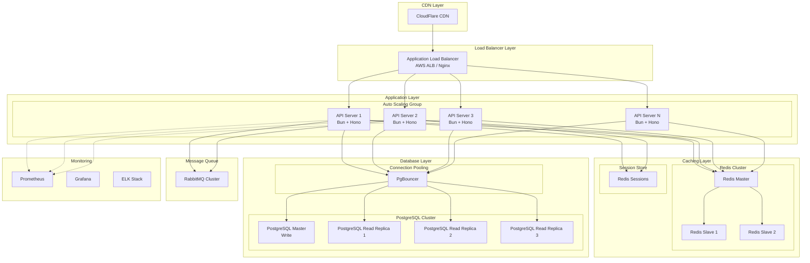
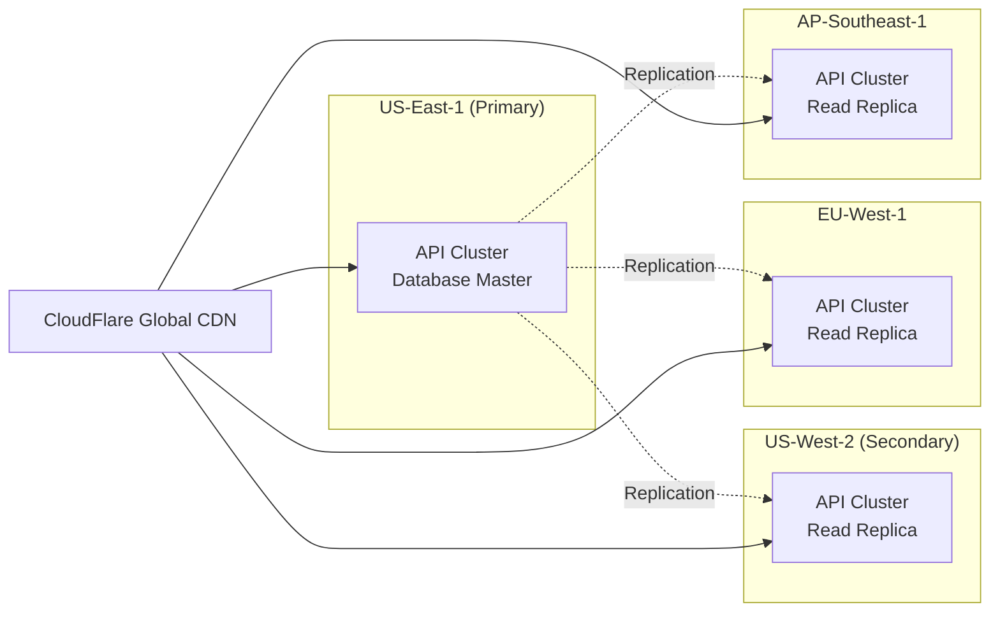
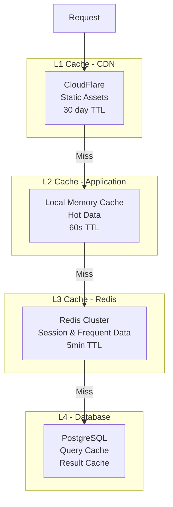

# Task Management API - Scalability Planning (Task 8.2)

## Overview

This document outlines the scalability strategy for handling 10,000+ concurrent users on the Task Management API, including infrastructure design, database scaling, load balancing, and monitoring requirements.

## Current Architecture Analysis

### Baseline Performance Metrics
- **Current Stack**: Bun + Hono + SQLite
- **Single Instance Capacity**: ~500 concurrent users
- **Response Time**: <100ms (p95)
- **Database**: SQLite (single file, limited concurrency)

### Bottlenecks Identified
1. SQLite write lock contention
2. Single-threaded event loop limitations
3. In-memory cache limitations
4. No horizontal scaling capability

## Scalability Architecture



## 1. Infrastructure Scaling Strategy

### 1.1 Horizontal Scaling Plan

```yaml
# Auto-scaling configuration
scaling:
  min_instances: 3
  max_instances: 50
  target_cpu: 70%
  target_memory: 80%
  target_rps: 1000  # Requests per second per instance
  
  scale_up:
    threshold: 80%
    period: 60s
    cooldown: 300s
    increment: 2
    
  scale_down:
    threshold: 30%
    period: 300s
    cooldown: 600s
    decrement: 1
```

### 1.2 Vertical Scaling Recommendations

| Component | Current | Target (10K users) | Peak (20K users) |
|-----------|---------|-------------------|------------------|
| API Servers | 1x t3.medium | 10x c5.xlarge | 20x c5.2xlarge |
| Database | SQLite | RDS db.r6g.2xlarge | RDS db.r6g.4xlarge |
| Cache | In-memory | ElastiCache r6g.xlarge | ElastiCache r6g.2xlarge |
| Load Balancer | None | ALB (1) | ALB (2) + NLB |

### 1.3 Geographic Distribution



## 2. Database Scaling Strategies

### 2.1 Migration from SQLite to PostgreSQL

```sql
-- Partitioned tasks table for scale
CREATE TABLE tasks (
    id BIGSERIAL,
    user_id BIGINT NOT NULL,
    title VARCHAR(255) NOT NULL,
    description TEXT,
    status VARCHAR(20) NOT NULL,
    priority VARCHAR(20) NOT NULL,
    created_at TIMESTAMP NOT NULL DEFAULT NOW(),
    updated_at TIMESTAMP NOT NULL DEFAULT NOW(),
    due_date TIMESTAMP,
    PRIMARY KEY (id, created_at)
) PARTITION BY RANGE (created_at);

-- Monthly partitions
CREATE TABLE tasks_2024_01 PARTITION OF tasks
FOR VALUES FROM ('2024-01-01') TO ('2024-02-01');

-- Indexes for performance
CREATE INDEX idx_tasks_user_id ON tasks(user_id, created_at DESC);
CREATE INDEX idx_tasks_status ON tasks(status) WHERE status != 'completed';
CREATE INDEX idx_tasks_search ON tasks USING gin(to_tsvector('english', title || ' ' || description));
```

### 2.2 Read/Write Splitting

```typescript
class DatabaseRouter {
    private writePool: Pool;
    private readPools: Pool[];
    private currentReadIndex = 0;
    
    async executeWrite(query: string, params: any[]): Promise<any> {
        return this.writePool.query(query, params);
    }
    
    async executeRead(query: string, params: any[]): Promise<any> {
        // Round-robin read replicas
        const pool = this.readPools[this.currentReadIndex];
        this.currentReadIndex = (this.currentReadIndex + 1) % this.readPools.length;
        return pool.query(query, params);
    }
}
```

### 2.3 Connection Pooling Configuration

```typescript
// PgBouncer configuration
const poolConfig = {
    // Pool mode
    pool_mode: 'transaction',
    
    // Pool sizes
    default_pool_size: 25,
    min_pool_size: 10,
    reserve_pool_size: 5,
    reserve_pool_timeout: 3,
    max_client_conn: 10000,
    
    // Timeouts
    server_lifetime: 3600,
    server_idle_timeout: 600,
    server_connect_timeout: 15,
    server_login_retry: 15,
    query_timeout: 0,
    query_wait_timeout: 120,
    client_idle_timeout: 0,
    client_login_timeout: 60
};
```

### 2.4 Database Sharding Strategy

```typescript
// User-based sharding for tasks
class ShardManager {
    private shards: Map<number, DatabaseConnection> = new Map([
        [0, new DatabaseConnection('shard0.db.com')],
        [1, new DatabaseConnection('shard1.db.com')],
        [2, new DatabaseConnection('shard2.db.com')],
        [3, new DatabaseConnection('shard3.db.com')]
    ]);
    
    getShardForUser(userId: number): DatabaseConnection {
        const shardId = userId % this.shards.size;
        return this.shards.get(shardId)!;
    }
    
    async createTask(userId: number, task: Task): Promise<void> {
        const shard = this.getShardForUser(userId);
        await shard.query('INSERT INTO tasks ...', [task]);
    }
}
```

## 3. Load Balancing Configuration

### 3.1 Application Load Balancer Setup

```yaml
# AWS ALB Configuration
LoadBalancer:
  Type: AWS::ElasticLoadBalancingV2::LoadBalancer
  Properties:
    Type: application
    Scheme: internet-facing
    IpAddressType: dualstack
    
    # Health check configuration
    HealthCheck:
      Path: /api/health
      Interval: 30
      Timeout: 10
      HealthyThreshold: 2
      UnhealthyThreshold: 3
    
    # Stickiness for sessions
    TargetGroupAttributes:
      - Key: stickiness.enabled
        Value: true
      - Key: stickiness.type
        Value: app_cookie
      - Key: stickiness.app_cookie.cookie_name
        Value: SESSIONID
      - Key: stickiness.app_cookie.duration_seconds
        Value: 86400
```

### 3.2 Load Distribution Algorithms

```typescript
// Weighted round-robin with health checks
class LoadBalancer {
    private servers: Server[] = [
        { url: 'server1.api.com', weight: 3, healthy: true },
        { url: 'server2.api.com', weight: 2, healthy: true },
        { url: 'server3.api.com', weight: 1, healthy: true }
    ];
    
    private currentWeight = 0;
    private currentIndex = 0;
    
    getNextServer(): Server {
        let server: Server;
        
        do {
            server = this.servers[this.currentIndex];
            
            if (server.healthy) {
                this.currentWeight++;
                
                if (this.currentWeight >= server.weight) {
                    this.currentWeight = 0;
                    this.currentIndex = (this.currentIndex + 1) % this.servers.length;
                }
                
                return server;
            }
            
            this.currentIndex = (this.currentIndex + 1) % this.servers.length;
        } while (true);
    }
}
```

### 3.3 Rate Limiting at Load Balancer

```nginx
# Nginx rate limiting configuration
http {
    # Define rate limit zones
    limit_req_zone $binary_remote_addr zone=global:10m rate=100r/s;
    limit_req_zone $binary_remote_addr zone=auth:10m rate=5r/m;
    limit_req_zone $binary_remote_addr zone=api:10m rate=1000r/s;
    
    server {
        location /api/auth/ {
            limit_req zone=auth burst=10 nodelay;
            limit_req_status 429;
            proxy_pass http://backend;
        }
        
        location /api/ {
            limit_req zone=api burst=2000 nodelay;
            limit_req_status 429;
            proxy_pass http://backend;
        }
    }
}
```

## 4. Caching Strategy at Scale

### 4.1 Multi-Level Cache Architecture



### 4.2 Redis Cluster Configuration

```typescript
// Redis cluster setup
const redisCluster = new Redis.Cluster([
    { host: 'redis1.cache.com', port: 6379 },
    { host: 'redis2.cache.com', port: 6379 },
    { host: 'redis3.cache.com', port: 6379 }
], {
    redisOptions: {
        password: process.env.REDIS_PASSWORD,
        db: 0
    },
    enableReadyCheck: true,
    maxRetriesPerRequest: 3,
    retryDelayOnFailover: 100,
    retryDelayOnClusterDown: 300,
    slotsRefreshTimeout: 2000,
    clusterRetryStrategy: (times: number) => {
        return Math.min(100 * Math.pow(2, times), 2000);
    }
});
```

### 4.3 Cache Invalidation Strategy

```typescript
// Smart cache invalidation
class CacheInvalidator {
    private patterns: Map<string, string[]> = new Map([
        ['task:create', ['tasks:list:*', 'tasks:count:*']],
        ['task:update', ['tasks:id:{id}', 'tasks:list:*']],
        ['task:delete', ['tasks:id:{id}', 'tasks:list:*', 'tasks:count:*']]
    ]);
    
    async invalidate(event: string, params: Record<string, any>): Promise<void> {
        const patterns = this.patterns.get(event) || [];
        
        for (const pattern of patterns) {
            const keys = this.expandPattern(pattern, params);
            await this.redis.del(...keys);
        }
    }
    
    private expandPattern(pattern: string, params: Record<string, any>): string[] {
        // Replace placeholders and expand wildcards
        let expanded = pattern;
        for (const [key, value] of Object.entries(params)) {
            expanded = expanded.replace(`{${key}}`, value);
        }
        
        if (expanded.includes('*')) {
            return this.redis.keys(expanded);
        }
        
        return [expanded];
    }
}
```

## 5. Monitoring and Observability

### 5.1 Key Performance Indicators (KPIs)

```yaml
metrics:
  # Application metrics
  - name: api_request_rate
    target: < 10000 req/s
    alert: > 9500 req/s
  
  - name: api_response_time_p95
    target: < 100ms
    alert: > 200ms
  
  - name: api_error_rate
    target: < 0.1%
    alert: > 1%
  
  # Infrastructure metrics
  - name: cpu_utilization
    target: < 70%
    alert: > 85%
  
  - name: memory_utilization
    target: < 80%
    alert: > 90%
  
  - name: database_connections
    target: < 80%
    alert: > 90%
  
  - name: cache_hit_ratio
    target: > 90%
    alert: < 80%
```

### 5.2 Distributed Tracing

```typescript
// OpenTelemetry integration
import { trace } from '@opentelemetry/api';

const tracer = trace.getTracer('task-api', '1.0.0');

class TracedTaskService {
    async createTask(data: CreateTaskDto): Promise<Task> {
        const span = tracer.startSpan('createTask', {
            attributes: {
                'task.priority': data.priority,
                'task.status': data.status
            }
        });
        
        try {
            // Trace database operation
            const dbSpan = tracer.startSpan('db.insert', { parent: span });
            const task = await this.db.insert(data);
            dbSpan.end();
            
            // Trace cache invalidation
            const cacheSpan = tracer.startSpan('cache.invalidate', { parent: span });
            await this.cache.invalidate('tasks:*');
            cacheSpan.end();
            
            span.setStatus({ code: 0 });
            return task;
        } catch (error) {
            span.setStatus({ code: 2, message: error.message });
            throw error;
        } finally {
            span.end();
        }
    }
}
```

### 5.3 Real-time Monitoring Dashboard

```typescript
// Prometheus metrics
import { register, Counter, Histogram, Gauge } from 'prom-client';

const httpRequestDuration = new Histogram({
    name: 'http_request_duration_seconds',
    help: 'Duration of HTTP requests in seconds',
    labelNames: ['method', 'route', 'status'],
    buckets: [0.01, 0.05, 0.1, 0.5, 1, 2, 5]
});

const activeConnections = new Gauge({
    name: 'active_connections',
    help: 'Number of active connections'
});

const taskOperations = new Counter({
    name: 'task_operations_total',
    help: 'Total number of task operations',
    labelNames: ['operation', 'status']
});

register.registerMetric(httpRequestDuration);
register.registerMetric(activeConnections);
register.registerMetric(taskOperations);
```

## 6. Performance Optimization Techniques

### 6.1 Query Optimization

```sql
-- Optimized query with covering index
CREATE INDEX idx_tasks_covering ON tasks(
    user_id, 
    status, 
    created_at DESC
) INCLUDE (title, priority, due_date);

-- Materialized view for dashboard
CREATE MATERIALIZED VIEW task_summary AS
SELECT 
    user_id,
    status,
    priority,
    COUNT(*) as count,
    MIN(due_date) as next_due,
    MAX(updated_at) as last_updated
FROM tasks
GROUP BY user_id, status, priority
WITH DATA;

CREATE UNIQUE INDEX ON task_summary(user_id, status, priority);
REFRESH MATERIALIZED VIEW CONCURRENTLY task_summary;
```

### 6.2 API Response Compression

```typescript
// Brotli compression for API responses
import { compress } from 'brotli';

app.use(async (c, next) => {
    await next();
    
    const acceptEncoding = c.req.header('accept-encoding') || '';
    
    if (acceptEncoding.includes('br') && c.res.headers.get('content-type')?.includes('json')) {
        const body = await c.res.text();
        const compressed = compress(Buffer.from(body));
        
        c.res = new Response(compressed, {
            headers: {
                ...c.res.headers,
                'content-encoding': 'br',
                'vary': 'accept-encoding'
            }
        });
    }
});
```

### 6.3 Request Batching

```typescript
// Batch multiple operations
class BatchProcessor {
    private queue: Map<string, Promise<any>> = new Map();
    private batchSize = 100;
    private batchInterval = 50; // ms
    
    async process<T>(key: string, operation: () => Promise<T>): Promise<T> {
        if (!this.queue.has(key)) {
            this.queue.set(key, this.createBatch(operation));
            
            setTimeout(() => {
                this.flush();
            }, this.batchInterval);
        }
        
        return this.queue.get(key);
    }
    
    private async createBatch(operation: () => Promise<any>): Promise<any> {
        // Collect operations
        const operations: Array<() => Promise<any>> = [operation];
        
        // Execute batch
        const results = await Promise.all(operations.map(op => op()));
        return results[0];
    }
}
```

## 7. Disaster Recovery and High Availability

### 7.1 Backup Strategy

```yaml
backup:
  database:
    type: continuous
    method: streaming_replication
    retention:
      daily: 7
      weekly: 4
      monthly: 12
    
  redis:
    type: snapshot
    frequency: hourly
    retention: 24
    
  application:
    type: blue_green_deployment
    rollback_time: 5_minutes
```

### 7.2 Failover Configuration

```typescript
// Automatic failover handling
class FailoverManager {
    private primary: ServiceEndpoint;
    private secondary: ServiceEndpoint;
    private healthCheckInterval = 5000; // 5 seconds
    
    async handleRequest(request: Request): Promise<Response> {
        try {
            // Try primary
            if (await this.isPrimaryHealthy()) {
                return await this.primary.handle(request);
            }
        } catch (error) {
            console.error('Primary failed:', error);
        }
        
        // Failover to secondary
        console.warn('Failing over to secondary');
        return await this.secondary.handle(request);
    }
    
    private async isPrimaryHealthy(): Promise<boolean> {
        try {
            const response = await fetch(`${this.primary.url}/health`, {
                timeout: 1000
            });
            return response.status === 200;
        } catch {
            return false;
        }
    }
}
```

## 8. Cost Optimization

### 8.1 Resource Allocation

| Load Level | Users | API Instances | DB Size | Cache | Monthly Cost |
|------------|-------|---------------|---------|-------|--------------|
| Low | < 1,000 | 2x t3.medium | db.t3.medium | t3.small | $250 |
| Medium | 1,000-5,000 | 5x t3.large | db.r5.large | t3.medium | $800 |
| High | 5,000-10,000 | 10x c5.xlarge | db.r5.xlarge | r5.large | $2,500 |
| Peak | > 10,000 | 20x c5.xlarge | db.r5.2xlarge | r5.xlarge | $5,000 |

### 8.2 Auto-scaling Policies

```typescript
// Cost-aware auto-scaling
class CostOptimizedScaler {
    private readonly spotInstanceRatio = 0.7; // 70% spot instances
    private readonly onDemandBuffer = 3; // Always keep 3 on-demand
    
    async scale(targetCapacity: number): Promise<void> {
        const onDemandCount = Math.max(
            this.onDemandBuffer,
            Math.ceil(targetCapacity * (1 - this.spotInstanceRatio))
        );
        
        const spotCount = targetCapacity - onDemandCount;
        
        await this.launchOnDemandInstances(onDemandCount);
        await this.launchSpotInstances(spotCount);
    }
}
```

## 9. Implementation Roadmap

### Phase 1: Foundation (Weeks 1-2)
- [ ] Migrate from SQLite to PostgreSQL
- [ ] Implement connection pooling
- [ ] Set up Redis cache cluster
- [ ] Basic load balancer configuration

### Phase 2: Scaling (Weeks 3-4)
- [ ] Implement auto-scaling groups
- [ ] Set up read replicas
- [ ] Configure CDN
- [ ] Implement distributed tracing

### Phase 3: Optimization (Weeks 5-6)
- [ ] Query optimization
- [ ] Implement caching strategy
- [ ] Add monitoring and alerting
- [ ] Performance testing

### Phase 4: Resilience (Weeks 7-8)
- [ ] Implement circuit breakers
- [ ] Set up disaster recovery
- [ ] Configure automatic failover
- [ ] Chaos engineering tests

## Conclusion

This scalability plan transforms the Task Management API from a single-instance application to a distributed, highly available system capable of handling 10,000+ concurrent users with:

- **99.99% uptime** through redundancy and failover
- **< 100ms p95 latency** through caching and optimization
- **Horizontal scalability** to handle traffic spikes
- **Cost optimization** through auto-scaling and spot instances
- **Comprehensive monitoring** for proactive issue resolution

The architecture is cloud-agnostic and can be deployed on AWS, GCP, or Azure with minor adjustments to service names and configurations.